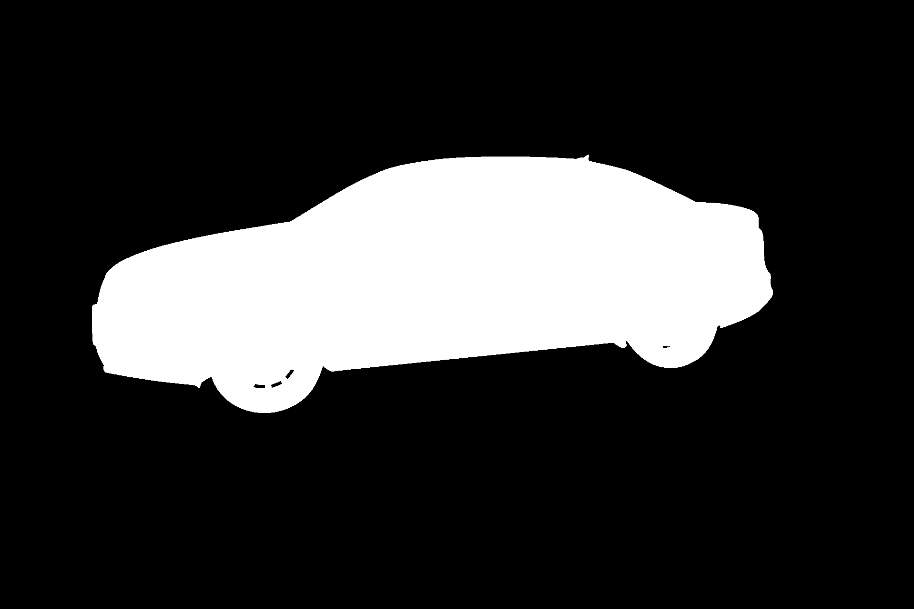
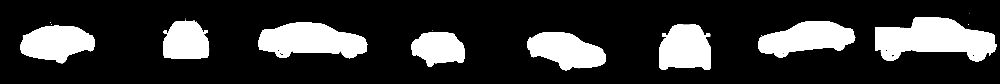
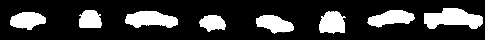

# U-Net Implementation
#### By Christopher Ley

This is my interpretation and implementation of the famous paper "_[U-Net: Convolutional Networks for Biomedical Image Segmentation](https://arxiv.org/abs/1505.04597)_"
 using the [Carvana Image Masking Dataset](https://www.kaggle.com/c/carvana-image-masking-challenge) in PyTorch

This data set is a Binary Segmentation exercise of ~400 test images of cars from various angles such as those shown here:
<p float="left">
    
    
</p>

### Initial implementation for Binary Segmentation

The implementation performs almost as the winners of the competition (Dice: 0.9926 vs 0.99733) after only 5 epoch and we would expect the results
to be as good as the winners using this architecture with more training and a little tweaking of the training
hyper-parameters.

Here are the scores for training over 5 epochs by running:

```bash
(DeepLearning): python3 train.py
```

### Training Results

```bash
0%|          | 0/540 [00:00<?, ?it/s]Accuracy: 103298971/467927040 = 22.08%
Dice score: 0.36127230525016785
100%|██████████| 540/540 [05:59<00:00,  1.50it/s, loss=0.0949]
==> Saving Checkpoint to: ./checkpoints/checkpoint_2022-01-06_12:39_epoch_0.pth.tar
Accuracy: 460498379/467927040 = 98.41%
Dice score: 0.9652246236801147
100%|██████████| 540/540 [05:59<00:00,  1.50it/s, loss=0.0469]
==> Saving Checkpoint to: ./checkpoints/checkpoint_2022-01-06_12:48_epoch_1.pth.tar
Accuracy: 461809183/467927040 = 98.69%
Dice score: 0.9711439609527588
100%|██████████| 540/540 [05:56<00:00,  1.51it/s, loss=0.0283]
==> Saving Checkpoint to: ./checkpoints/checkpoint_2022-01-06_12:56_epoch_2.pth.tar
Accuracy: 465675737/467927040 = 99.52%
Dice score: 0.9891990423202515
100%|██████████| 540/540 [06:00<00:00,  1.50it/s, loss=0.0194]
==> Saving Checkpoint to: ./checkpoints/checkpoint_2022-01-06_13:04_epoch_3.pth.tar
Accuracy: 465397979/467927040 = 99.46%
Dice score: 0.9878408908843994
100%|██████████| 540/540 [06:00<00:00,  1.50it/s, loss=0.0142]
==> Saving Checkpoint to: ./checkpoints/checkpoint_2022-01-06_13:12_epoch_4.pth.tar
Accuracy: 466399501/467927040 = 99.67%
Dice score: 0.9926225543022156

```
And an example of the output vs the ground truth of the validation set, I removed whole makes for the validation set,
all 16 angles, the network had never seen this particular make from any angle.

<p float="left">
    <h3>Ground Truth</h3>
    
    <h3>Prediction</h3>
    </p>

Although limited in scope (binary segmentation for only cars), this architecture performs well with
multiclass segmentation, I extended this to apply segmentation to the [NYUv2](https://cs.nyu.edu/~silberman/datasets/nyu_depth_v2.html)
which is a multiclass objective, with little modification to the above code.

I will clean this up and upload the results and modifications soon!
